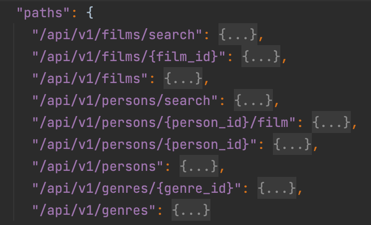
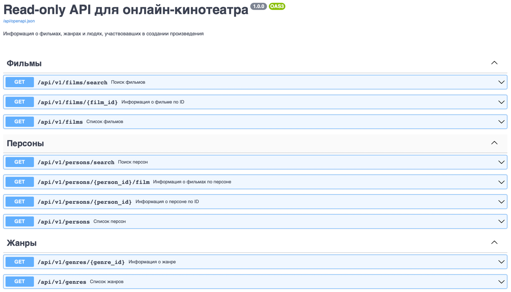

# Асинхронный API онлайн-кинотеатра

## 1 Назначение модуля:

Данный модуль является частью проекта "Онлайн-кинотеатр", в которой представлена **асинхронная реализация API** для получения информации об отдельных сущностях киноиндустрии (кинопроизведения, актеры, жанры).

---

## 2 Структура проекта "Онлайн-кинотеатр"

### Ссылки на предыдущие проекты указаны в списке ниже.
Проект "Онлайн-кинотеатр" представляет собой набор микросервисов: 

- [Панель администратора](https://github.com/montekrist0/new_admin_panel_sprint_2) - графический интерфейс для работы 
с содержимым онлайн-кинотеатра (жанры, люди, фильмы);
- [ETL](https://github.com/montekrist0/new_admin_panel_sprint_3) - сервис для переноса данных из PostgreSQL в ElasticSearch;
- API - REST-сервис для получения информации об отдельных сущностях онлайн-кинотеатра.

---

## 3 Используемые технологии проекта "Онлайн-кинотеатр"

Технологический стек проекта:

1. [Elasticsearch](https://www.elastic.co) — NoSQL БД для полнотекстового поиска;
2. [PostgreSQL](https://www.postgresql.org/) — SQL база данных (БД);
3. [Redis](https://redis.io) — key-value БД (в проекте используется для кеширования данных и хранения состояний при переносе данных из PostgreSQL в ElasticSearch)
4. [Kibana](https://www.elastic.co/kibana/) - веб-интерфейс для взаимодействия с Elasticsearch
5. [Nginx](https://www.nginx.com/) — веб-сервер;
6. Django-Gunicorn — веб-приложение на базе веб-фреймворка
   [Django](https://docs.djangoproject.com/en/4.1/releases/3.2/) с
   WSGI-сервером [Gunicorn](https://gunicorn.org/);
7. ETL-скрипт, реализованный на языке Python;

Каждый модуль (сервис) запускается с помощью [Docker](https://www.docker.com/) контейнеров, тем самым реализуя в проекте микросервисную архитектуру.
Сервисы связаны между собой с помощью `docker compose`.

---

## 4 Порядок запуска проекта

Для упрощения работы в проекте предусмотрен Makefile.
Для быстрого и полного запуска проекта достаточно, находясь в корне репозитория,
выполнить команду `make up`.

Данная команда является составной и выполняет следующее:

1. создаст контейнеры на основе `docker-compose.yml` файла,
   а также именованные `volume`, предназначенные для хранения файлов, данных из БД и т.п..
2. запустит сервер админ-панели джанго, применит миграции и загрузит статические файлы 
3. запустит ETL-script для переноса данных из PostgreSQL в хранилище Elasticsearch
4. запустит асинхронный API-сервис для получения данных о сущностях онлайн-кинотеатра

Каждое из описанных выше в списке действий может быть выполнено с помощью
отдельных команд Makefile.

Таким образом, можно запустить "_голый_" проект и выполнить только те команды,
которые требуется.

Больше команд прописано в `Makefile`.
___
## 5 Описание API

В сервисе реализован read-only API для поиска фильмов, жанров, людей в сервисе онлайн-кинотеатра.
Последняя версия API: 1.0.0.
Для получения информации с помощью API достаточно выполнить GET-запросы по соответствующему префиксу:

1. Для поиска фильмов: http://localhost/api/v1/films/
2. Для поиска жанров: http://localhost/api/v1/genres/
3. Для поиска персон: http://localhost/api/v1/persons/

Все доступные пути и их параметры запросов можно найти в файле-спецификации `openapi.json`. 
Ниже скриншот доступных путей API из данного файла:

Для удобства тестирования сервиса можно воспользоваться сервисом Swagger:
Ниже представлен скриншот сервиса Swagger: 

Для того, чтобы перейти в Swagger, требуется ввести следующий адрес в адресной строке браузера:

[http://localhost/api/openapi](http://localhost/api/openapi)

___

## 6 Тестирование API

Для запуска тестов

## 7 Требования для запуска проекта:

Перед запуском может потребоваться остановить локальный клиент PostgreSQL, если имеется.

1. установленный и запущенный Docker Daemon;
2. доступ к интернету;
3. не менее 3 Гб свободного дискового пространства;
